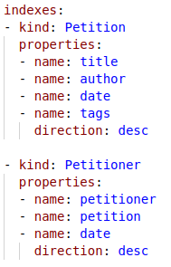

# Mini Petition App

## Description

Mini Petition App est une application web qui permet aux utilisateurs de créer et de signer des pétitions en ligne. Les utilisateurs peuvent créer des pétitions sur différents sujets, les signer et voir les pétitions les plus populaires.
Pour les tag sans être connecté on peut avoir toutes les information en reherchant juste le tag concerné, on verra liste des petitions utilisant le même tag. 

## Réalisateurs

-

## Screenshots des "Kinds" Google Datastore Utilisés



## Fonctionnalités

### Ce qui marche

- Création de pétitions
-Authentification
- Signature de pétitions
- Affichage des pétitions les plus populaires
- Recherche de pétitions par tag

### Ce qui ne marche pas

- Recherche des signataires d'une pétition spécifique (quelques petits bugs)
- Affichage des pétitions signées par un utilisateur

```markdown
## Lien vers l'application

[Lien vers l'application](https://projectcloud-412013.ew.r.appspot.com/)

## Lien vers le dépôt uncloud Université de Nantes

[Lien vers le depot uncloud](https://uncloud.univ-nantes.fr/index.php/s/3ryoLf2kZ9nksmP)
```

## License

```markdown
Ce projet est sous licence MIT. Pour plus d'informations, consultez le fichier [LICENSE](LICENSE).
```